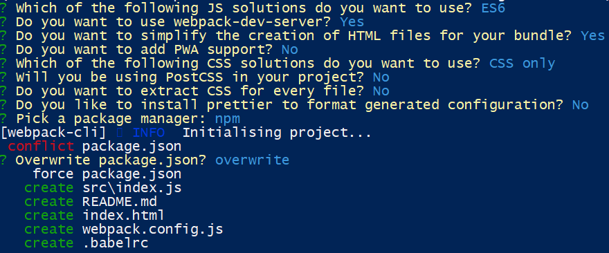

# TP 4 - prise en main de la stack JS (suite)

Dans ce TP, vous allez commencer la prise en main de la stack côté client. Pour cela, vous commencerez par réaliser un client qui interroge une API, puis vous le packagerez et le transformerez progressivement.

## Objectifs

Approfondir votre utilisation des outils de gestion de projet et de programmation côté client.

  - Webpack
  - TypeScript (facultatif)

## Pointeurs

Documentation et tutos :

 - Webpack :
    - [installation](https://webpack.js.org/guides/installation/)
	- [packager un projet](https://webpack.js.org/guides/getting-started/)
	- [créer et gérer des `assets`](https://webpack.js.org/guides/asset-management/)
  - [ESLint](https://eslint.org/) (rappel)
  - [Babel](https://babeljs.io/) (compilation / transpilation en JS basique)
  - [Jasmine](https://jasmine.github.io/) (tests en JS)
  - [Leaflet](https://leafletjs.com/examples/quick-start/) (carte basée sur OpenStreetMap)
  - TypeScript :
    - [Documentation](https://www.typescriptlang.org/docs/)
    - [Mise en place d'un projet avec Babel + TS](https://github.com/microsoft/TypeScript-Babel-Starter)
    - [Utilisation avec WebPack](https://webpack.js.org/concepts/loaders/)
 
## Application

Dans ce TP, vous allez travailler sur le client de l'interface d'administration du jeu "The Pirate's' curse: des villageois et des pirates". Pour vous faire gagner du temps, une version initiale de l'interface du client vous est donnée [ici](https://forge.univ-lyon1.fr/m1if13/m1if13-2024/-/raw/main/tp4/tp4-sources.zip?inline=false).

Commencez par télécharger ce client et le décompresser dans le dossier `public` de votre serveur Express. Vous devriez avoir accès à ce client à la racine du chemin `/static` de votre serveur Express. ce client contient :

- une carte (CSS, script et requêtes asynchrones vers les "tuiles" qui composent la carte)
- plusieurs autres ressources (scripts, CSS, fonts)

Les formulaires et les scripts ne sont pour l'instant pas fonctionnels. Le seul script qui fonctionne est celui qui recentre la carte à l'endroit où vous cliquez, pour que vous ayez un exemple d'utiliation de l'API de LeafLet.

## 1. Fonctionnement du client

Dans cette partie, vous allez commencer par faire en sorte que votre client soit fonctionnel. Comme aux UEs précédentes, réalisez les scripts qui interagissent avec la carte et avec le serveur pour que les différentes parties de l'interface fonctionnent normalement.

_Fonctionnalités_ :

- La page de login permettra de récupérer un token pour pouvoir interroger la partie `/api` du serveur et recevoir les positions des ressources sur la carte. Vous devrez envoyer une requête asynchrone en CORS au serveur Spring et mémoriser le token avant de changer de page.
- Pour vous dérouiller côté client, vous devrez faire fonctionner le premier formulaire de la page `admin.html` : mettre à jour les différents champs quand la carte est modifiée, et déplacer / zoomer la carte quand la valeur d'un champ change. Aidez-vous de la [doc de Leaflet](https://leafletjs.com/reference.html) pour cela.
- Pour la ZRR, l'utilisateur devra positionner la carte où il veut que le jeu se tienne et cliquer sur le bouton "Set" pour définir la ZRR aux limites de la carte, puis sur "Send" pour l'envoyer au serveur. &Agrave; vous de mettre en place les scripts correspondants.
- Pour le TTL, vous pouvez suivre un fonctionnement similaire à celui utilisé pour l'envoi de la ZRR.
- Le jeu sera lancé dès le login des différents utilisateurs. Vous devrez donc envoyer régulièrement des requêtes à la partie `/api` d'Express pour pouvoir récupérer les ressources et les placer sur la carte.

_Indications techniques_ :

- Le squelette de code qui vous est fourni gère les dépendances en utilisant les modules ES6. Il vous est demandé de conserver ce mode de gestion des dépendances.
- Pour requêter l'API du serveur Express, il est conseillé d'utiliser une "variable globale" qui représentera le chemin de base de cette API et que vous pourrez modifier par la suite (voir partie déploiement) ; dans la suite, on appellera cette variable `apiPath`. Pour vous conformer à la gestion des dépendances par modules, vous pouvez soit la passer en paramètre des fonctions, soit créer un module avec cette constante dedans et l'importer là où vous en aurez besoin (conseillé).
- Pour vérifier le fonctionnement, il peut être utile d'ajouter un utilisateur (mocké) au jeu dans Spring et de le "promener" sur la carte _via_ Express à l'aide de Postman.

&Agrave; ce stade, votre application "confidentielle" doit fonctionner correctement. Dans la suite du TP, vous allez modifier la stack technique mais vous ne changerez plus ses fonctionnalités.

**Avant de passer à la suite, faites un premier push de votre client sur la forge.**

## 2. Utilisation d'un bundler

Dans cette partie, vous allez passer votre application "sous" webpack.

### 2.1. Initialisation d'un projet webpack

- Créer un dossier `admin` à la racine de votre repo
- Initialiser un projet NPM : `npm init`
  - entrez les nom, description, keywords qui vous conviennent
  - pour "test command", entrez "test"
- Installer webpack et webpack-cli dans le projet : `npm install webpack webpack-cli @webpack-cli/generators --save-dev`
- Lancer la commande `npx webpack-cli init` (voir [doc](https://github.com/webpack/webpack-cli/blob/master/packages/webpack-cli/README.md)) pour initialiser le fichier `webpack.config.js`, ainsi que les autres fichiers de configuration du projet et une structure de base pour l'application. Répondez comme suit aux différentes questions posées par `webpack-cli` :



- Lancez le serveur de dev inclus avec `npx webpack-cli serve` : l'application générée doit démarrer automatiquement. Dans la console de dev, vous devez avoir un log du fichier `index.js`
- Vérifiez le fonctionnement du _Hot Module Replacement (HMR)_ en modifiant le contenu du log du fichier index.js et en sauvegardant ce fichier ; la console doit se mettre à jour automatiquement.

Vous êtes maintenant prêts à ajouter le métier de votre application.

### 2.2. Intégration de votre projet dans webpack

Vous allez donc reprendre le client statique (`admin.html`) en recopiant les "bonnes" parties dans votre répertoire `admin` :

- Remplacez le contenu de la page `index.html` par celui de la page `admin.html`, mais **supprimez la balise &lt;script&gt; à la fin du fichier** (c'est webpack qui se chargera de faire l'importation)
- recopiez les scripts JS dans le répertoire `src` (écrasez `index.js`)
- recopiez les contenus des répertoires `css` et `img` dans `src`

Si vous lancez `npx webpack-cli serve` maintenant, la page ne trouvera pas le CSS. Pour que webpack la rajoute au bundle, vous n'avez qu'à l'importer dans `index.js` comme si c'était un module JS : `import 'css/style.css';`

- Lancez `npx webpack-cli serve` pour vérifier que tout se passe bien
- Générez le bundle correspondant à votre projet avec la commande `npx webpack` (option par défaut : `build`). Cela vous génèrera un répertoire `dist` dans lequel vous avez l'ensemble des fichiers statiques que vous pourrez déployer sur votre serveur de production (`/api/static`).

Pour aller plus loin (optionnel) :

- **Positionnez la variable `apiPath` dans un "fichier d'entrée" (`entry`) de webpack.** (voir [ici](https://webpack.js.org/concepts/entry-points/) pour ajouter plusieurs fichiers d'entrée).
- Intégrez les dépendances de la page principale au projet en les cherchant dans NPM et en les installant **localement**. Remplacez les requêtes aux CDNs (ce n'est pas une bonne pratique, mais c'est pour l'exercice) par des requêtes dans le repository local (`node_modules`), **voir aide plus bas**.

**Aide :**

Il se peut que vous tombiez sur le problème suivant : une fois les icônes fournis avec Leaflet packagés avec webpack, ils ne sont pas retrouvés par la lib à cause d’une erreur de regexp. Il s'agit d'une issue non (correctement) résolue dans Leaflet  : https://github.com/Leaflet/Leaflet/issues/6496 . Le workaround est de rajouter dans map.js (uniquement dans la version webpack) une ligne comme :
  ```javascript
  L.Icon.Default.imagePath` = '/lib/leaflet/dist/images/';
  ```

où la partie droite permet d'accéder par une requête HTTP au répertoire contenant les icônes Leaflet.

&Agrave; la fin de cette partie, webpack a dû vous générer un répertoire `dist` contenant des fichiers statiques que vous pouvez copier dans la partie statique de votre serveur Express, afin d'exécuter l'application dans votre navigateur. Attention toutefois à ne pas écraser les fichiers de votre application source (qui doivent se trouver dans le même répertoire) en faisant cela...

## 3. TypeScript (optionnel)

Dans cette section, vous allez passer votre client en TypeScript, que vous retransformerez en JS à l'aide de Babel. Pour vous faire gagner du temps, nous vous fournissons un projet pré-configuré dans le fichier [tp4-base-typescript.zip](./tp4-base-typescript.zip). Il est fortement conseillé de traiter cette partie du TP dans une branche / un répertoire de travail séparés de la partie précédente.

Quelques explications sur les modules contenus dans le package.json (pour plus d'infos, recherchez le nom du package sur https://npmjs.com/) :
- Babel : compilateur vers du JS "simple"
- modules commençant par "@type/" : permettent à ESLint de comprendre les éléments de syntaxe TS
- prettier : corrige (si possible) les erreurs de format détectés par ESLint
- rimraf : supprime les répertoires temporaires pour éviter les "effets de cache"

Avant de lancer le build, analysez les différents fichiers de config pour comprendre ce que les différents éléments font. Puis, lancez le build et double-cliquez sur le fichier `dist/index.html`.

Inspirez-vous de ce projet pour passer votre code en TS. Au passage, typez les variables et profitez-en pour utiliser des classes et des imports de modules. Générez enfin un bundle correspondant à celui que vous aviez à la question précédente.

## 4. Mise en place d'une chaîne de build

- Comme au TP précédent, rajoutez ESLint dans les dev-dependencies de votre projet
- Rajoutez un script NPM `prebuild` qui lancera la validation du code avec ESLint, à l'aide du plugin [EslintWebpackPlugin](https://webpack.js.org/plugins/eslint-webpack-plugin/#root). Corrigez au besoin le code (ou adaptez quelques règles) pour qu'il passe la validation.
- Rajoutez un script `build` dans le fichier package.json pour pouvoir lancer webpack facilement. Vous pouvez rajouter d'autres commandes qui simplifient le déploiement (watch...), mais dans ce cas, indiquez dans votre readme quelle commande doit être exécutée pour lancer votre application.
- Rajoutez, avant la phase de build les phases de validation et de tests à l'aide d'un "pré-script" de build, comme indiqué [ici](https://docs.npmjs.com/cli/v7/using-npm/scripts#pre--post-scripts). Une fois le packaging de l'application terminé, vous pouvez aussi faire la copie des fichiers vers le répertoire `game/public` dans un "post-script" de la même façon.
- Générez le bundle correspondant à votre projet avec la commande `npm run build`, et vérifiez que toutes les phases de la chaîne de build se déroulent correctement.

&Agrave; la fin de cette partie, vous n'avez plus qu'une commande à taper pour déclencher toute la chaîne de build. Vous pourrez utiliser ce mécanisme dans la CI (voir section 6).

_Remarque :_ les mêmes fichiers ne pourront pas s'exécuter à la fois depuis le répertoire `static` d'Express et depuis la racine de votre serveur nginx car les URLs de l'API ne sont pas les mêmes depuis ces 2 emplacements. Il faudra faire plusieurs configurations.

## 5. Tests

Dans cette partie, vous allez mettre en place des tests unitaires avec Jasmine. Vous testerez dans un premier temps le fonctionnement de l'API côté serveur. En bonus, vous pouvez compléter par des tests des parties du code côté client.

- Suivre les 3 premières manipulations de [ce tuto](https://jasmine.github.io/pages/getting_started.html) pour installer l'outil de test Jasmine
- Suivez [la partie _Configuration_ de ce tuto](https://jasmine.github.io/setup/nodejs.html#configuration) pour configurer Jasmine dans votre projet.
- &Eacute;crivez vos tests en vous inspirant de la [first test suite](https://jasmine.github.io/tutorials/your_first_suite) et en suivant la syntaxe indiquée dans la [doc de l'API](https://jasmine.github.io/api/edge/global).
- Normalement, vous devez déjà avoir un script nommé `test` dans votre package.json. Vous pouvez le lancer avec `npm test`.

_Aide :_ Faites en sorte que ces tests se trouvent dans des fichiers avec des noms finissant par `.spec.js` et se trouvent dans un répertoire `test`, ce sera plus simple à configurer.

Indiquez dans votre readme les types de tests réalisés.

## 6. Déploiement

Vous déploierez la page HTML et le bundle webpack généré sur un chemin `/secret` du serveur nginx. Attention, la valeur de la variable `apiPath` ne sera pas la même que pour les fichiers générés déployés directement sur Express. Le plus simple est donc de faire un deuxième fichier d'entrée webpack, et de créer une autre configuration, identique à la première au fichier d'entrée près, et lancée à l'aide d'une autre commande NPM (par exemple : `npm run builprod`).

**Aide** : voir [ici](https://webpack.js.org/configuration/mode/) pour une explication de comment réaliser plusieurs configurations (p. ex. dev et prod) dans le même fichier de config webpack.

Mettez en place un script de CI qui utilise cette commande et déploie automatiquement les fichiers générés dans le bon répertoire de votre VM.

&Agrave; la fin de ce TP, toute votre application doit être fonctionnelle sur votre VM, à l'exception du client des joueurs, que vous simulerez via Postman. 

## Date de rendu

Ce TP et le précédent sont à pousser sur la forge et à déployer sur votre VM pour le **dimanche 7 avril 2024 à 23h59**.
